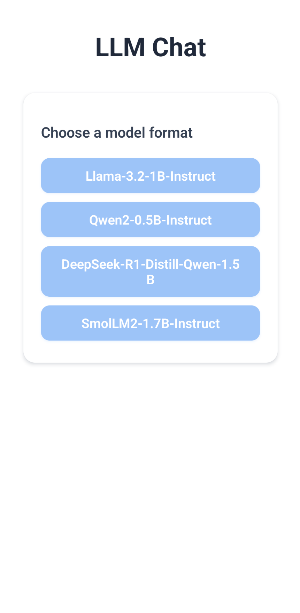
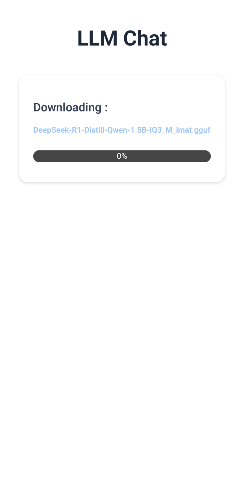

# Edge LLM | Llama Chat

> A React Native application for running Large Language Models directly on your mobile device, enabling offline chat capabilities.

EdgeLLM allows you to select from a variety of open-source quantized LLMs, download them to your device (HuggingFace), and engage in conversations powered by local inference

A variant of llama.cpp in React Native, 'llama.rn' is the key component to make this local inference work

## ✨ Features

*   **Model Selection:** Choose from a curated list of supported LLM formats.

*   **Dynamic GGUF Fetching:** Fetches available GGUF (quantized models) files for the selected model format from Hugging Face.

*   **On-Device Model Download:** Download selected GGUF model files directly to your device's storage.

*   **Local LLM Inference:** Utilizes `llama.rn` to run LLMs locally on your device.
*   **Chat Interface:** Engage in text-based conversations with the loaded LLM.

*   **Offline:** Once a model is downloaded, chat functionality works offline.

## 🚀 Tech Stack

*   **React Native:** For cross-platform mobile app development.
*   **TypeScript:** For type-safe JavaScript.
*   **`llama.rn`:** To run GGUF-formatted LLMs on-device.

## 📋 Prerequisites

Before you begin, ensure you have your development environment set up for React Native.

This includes:
*   Node.js (>=18, as specified in `package.json`)
*   npm or Yarn
*   Watchman (recommended for macOS)
*   JDK
*   Android Studio (for Android development)
*   Xcode (for iOS development on macOS)

## ⚙️ Getting Started

Follow these steps to get a local copy of the project up and running.

### 1. Clone this repository

### 2. Install the dependencies

### 3. Start Metro Bundler
> #### Using npm
```bash
npm start
```

> #### OR using Yarn
```bash
yarn start
```

### 4. Run the Application
> #### Using npm
```bash
npm run android | yarn android
```
> #### Using iOS
```bash
npm run ios | yarn ios
```

## 🤖 Available Models

The application currently supports selecting from the following model formats, which then fetch specific GGUF files:
* Llama-3.2-1B-Instruct (from medmekk/Llama-3.2-1B-Instruct.GGUF)
* Qwen2-0.5B-Instruct (from medmekk/Qwen2.5-0.5B-Instruct.GGUF)
* DeepSeek-R1-Distill-Qwen-1.5B (from medmekk/DeepSeek-R1-Distill-Qwen-1.5B.GGUF)
* SmolLM2-1.7B-Instruct (from medmekk/SmolLM2-1.7B-Instruct.GGUF)

## Now what? Next steps :
✅ Offline Chat
⌛ Explore new models
⌛ Customized UI and chat experience
⌛ Voice mode (using audio models, TTS and STT modules)
⌛ Multi-modal capabilities (audio, images, video)

> This project will serve as a base for my future mobile AI-powered projects, on the way ⌛⌛⌛